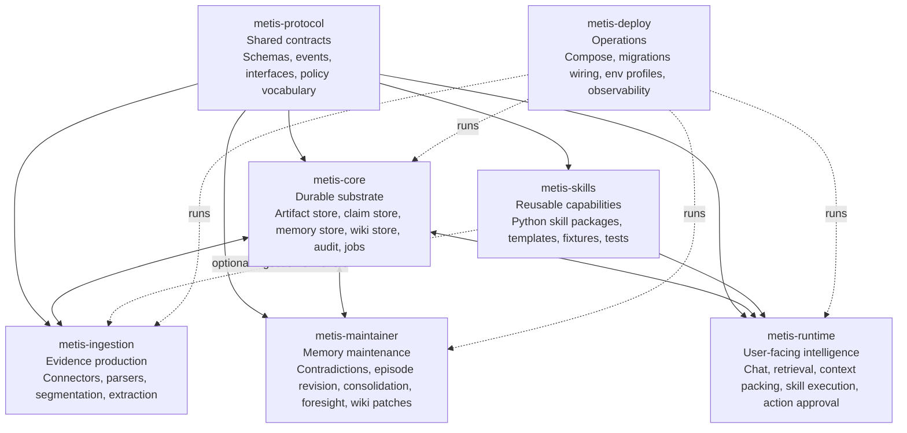
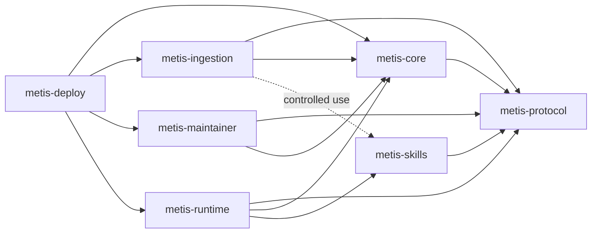
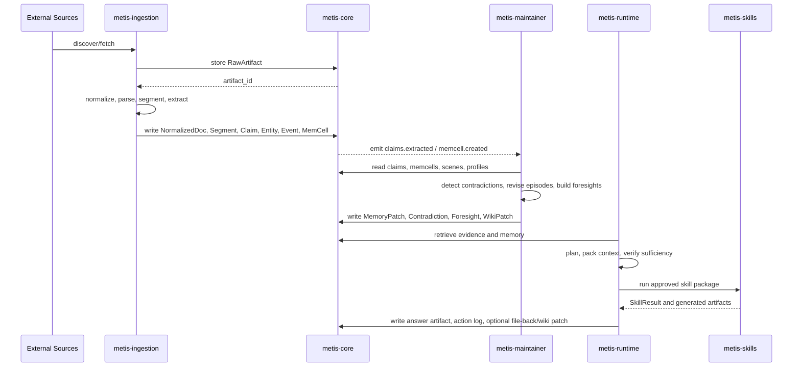
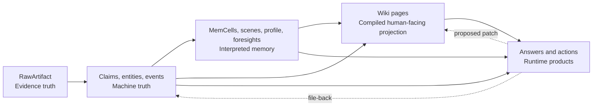
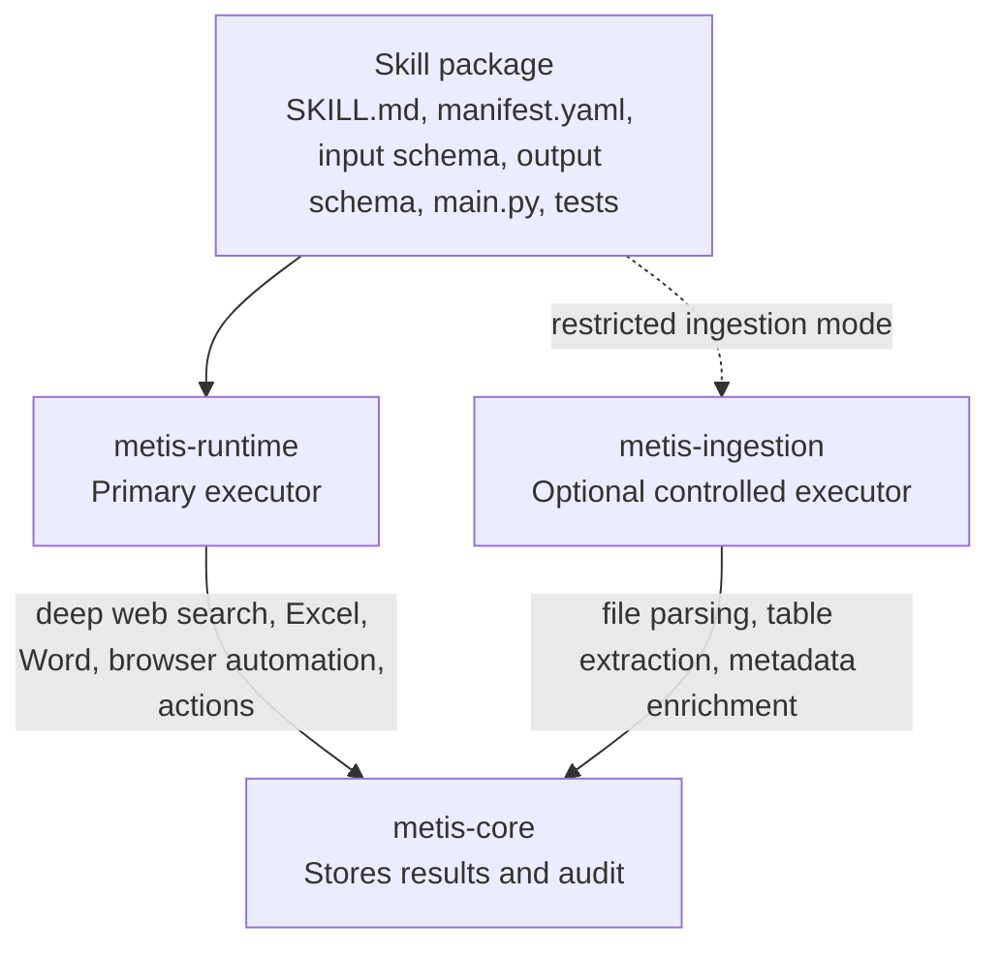
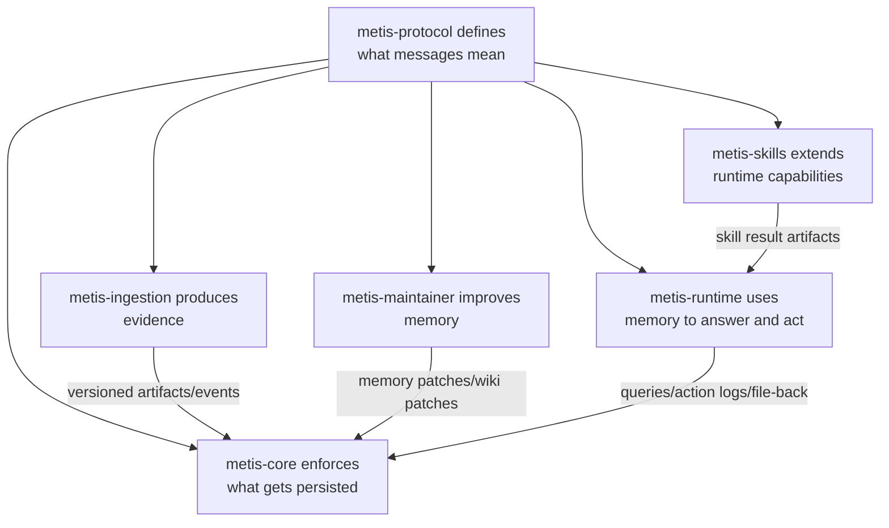

# Metis Engine Package Decomposition

This document shows the proposed responsibility zones and interconnections for a swappable Metis engine architecture.

Core rule: packages depend inward on shared contracts, but runtime data moves through versioned artifacts, events, and core storage APIs.

## Responsibility Map

## Dependency Direction

`metis-protocol` is the lowest-level shared package. It must not import from any other Metis package.

Allowed:

| Package | May depend on | Must not own |
|---|---|---|
| `metis-protocol` | Third-party schema/runtime basics only | Database code, LLM calls, connector code, skill execution |
| `metis-core` | `metis-protocol` | Source connectors, chat planning, skill logic |
| `metis-ingestion` | `metis-protocol`, `metis-core` | Background memory revision, user action execution |
| `metis-maintainer` | `metis-protocol`, `metis-core` | Connectors, UI/chat runtime, outbound actions |
| `metis-runtime` | `metis-protocol`, `metis-core`, `metis-skills` | Canonical ingestion parsing, storage internals |
| `metis-skills` | `metis-protocol` | Core stores, long-running schedulers |
| `metis-deploy` | All runtime packages | Business logic |

## Runtime Artifact Flow

## Core Truth Hierarchy

The wiki is important, but it should not be the machine source of truth. It should compile from claim IDs, memory objects, source spans, and validation state.

## Swappable Interfaces

These interfaces live in `metis-protocol`. Implementations live in the owning package.

```mermaid
classDiagram
    class Connector {
        <<Protocol>>
        discover(cursor) SourceRef[]
        fetch(ref) RawArtifact
        normalize(raw) NormalizedDoc
    }

    class Extractor {
        <<Protocol>>
        extract(parsed_doc) ExtractionBatch
    }

    class Consolidator {
        <<Protocol>>
        consolidate(batch) MemoryPatch
    }

    class ContradictionDetector {
        <<Protocol>>
        detect(scope) Contradiction[]
    }

    class ForesightBuilder {
        <<Protocol>>
        build(scope) Foresight[]
    }

    class Retriever {
        <<Protocol>>
        retrieve(query) EvidenceSet
    }

    class ContextPacker {
        <<Protocol>>
        pack(query, evidence) ContextBundle
    }

    class Skill {
        <<Protocol>>
        run(input, context) SkillResult
    }

    class ArtifactStore {
        <<Protocol>>
        put(raw) ArtifactRef
        get(ref) RawArtifact
    }

    class ClaimStore {
        <<Protocol>>
        write(batch) ClaimWriteResult
        query(filter) Claim[]
    }
```

Example implementation ownership:

| Interface | Example implementation | Owning package |
|---|---|---|
| `Connector` | `SlackConnector`, `LocalFolderConnector`, `ImapConnector` | `metis-ingestion` |
| `Extractor` | `PdfExtractor`, `DocxExtractor`, `EmailThreadExtractor` | `metis-ingestion` |
| `Consolidator` | `SceneConsolidator` | `metis-maintainer` |
| `ContradictionDetector` | `ClaimContradictionDetector` | `metis-maintainer` |
| `ForesightBuilder` | `TimelineForesightBuilder` | `metis-maintainer` |
| `Retriever` | `HybridRetriever`, `SceneRetriever` | `metis-runtime` |
| `ContextPacker` | `BudgetedContextPacker` | `metis-runtime` |
| `Skill` | `DeepWebSearchSkill`, `ExcelAnalysisSkill`, `WordReportSkill` | `metis-skills`, executed by `metis-runtime` |
| `ArtifactStore` | `PostgresMinioArtifactStore` | `metis-core` |
| `ClaimStore` | `PostgresClaimStore` | `metis-core` |

## Skill Placement

Skill usage modes:

| Mode | Owner | Allowed behavior |
|---|---|---|
| Query/action mode | `metis-runtime` | Search, analyze files, generate reports, execute approved actions, write answer artifacts |
| Ingestion enrichment mode | `metis-ingestion` | Parse unusual files, extract tables, classify docs, enrich metadata |
| Maintenance mode | `metis-maintainer` | Specialized lint, contradiction scans, repair proposals |

Ingestion-mode skills should not directly edit the wiki, revise memory, send messages, or perform broad network actions unless the manifest and policy explicitly allow it.

## Package Contract Summary

